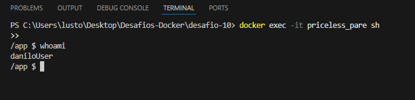

# DESAFIO -10
## ✅ Descrição 
## criar uma imagem com Node-Js usando o Dockerfile com um usuario não root.
## - 1 Criei o arquivo `Dockerfile` com o seguinte conteúdo:
```docker
FROM node:24-alpine3.20
WORKDIR /app
RUN adduser -D daniloUser
USER daniloUser
COPY . /app
EXPOSE 3000
CMD ["node", "hello-world.js"]
```
## - 2 Criei o arquivo `index.js` com o seguinte conteúdo para que o container fique rodando até que seja parado manualmente:
```javascript
while (true) {
   
}
```
## - 3 Usei o comando `docker build -t desafio-10 .` para criar a imagem e o comando `docker run -d  desafio-10  ` para rodar o container.
## - 4 Entrei dentro do container usando o comando `docker exec -it <container_id> sh` e verifiquei se o usuario era o correto usando o comando `whoami` e obtive a seguinte resposta:
 