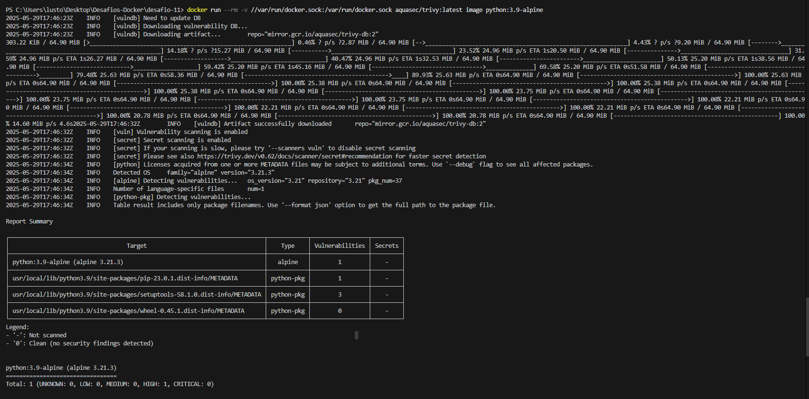
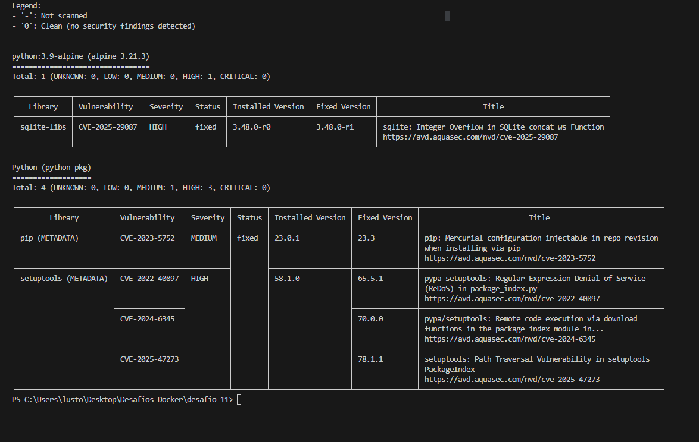
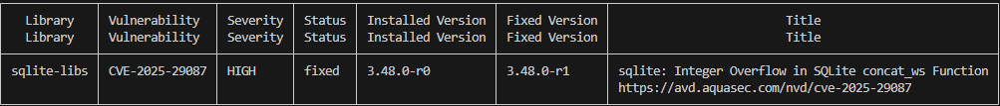
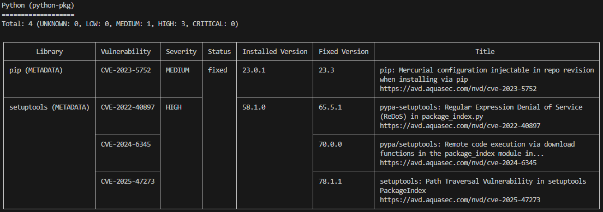

# DESAFIO -7
## ✅ Descrição  
## Utilização da ferramenta Trivy para fazer uma verificação de vulnerabilidade em uma imagem python:3.9 🔬
## - 1 ao executar o comando `docker run --rm -v //var/run/docker.sock:/var/run/docker.sock aquasec/trivy:latest image python:3.9-alpine` temos a seguinte saida :
 

## - 2 a saida nos mostra a biblioteca, SQL-Lite, que está com uma vunerabilidade e a versão que tem esse erro corrigido :
  
 # ❌versão com erro 3.48.0-r0
 ## O produto realiza um cálculo que pode causar estouro de inteiro, assumindo incorretamente que o resultado será sempre maior que o valor original. Isso pode afetar o controle de recursos ou a execução do sistema.
 # ✅ versão corrigida 3.48.0-r1
 ## para corrigir esse erro pode usar o comando a baixo no seu dockerfile
 ```docker
 RUN apk update && apk upgrade --no-cache
 ```
## ou para garantir que está instalando a versão especifica e corrigida do SQLite
 ```docker
RUN apk add --no-cache sqlite-libs=3.48.0-r1
 ```
## -3 No segundo bloco temos as vunerabilidades das bibliotecas `pip` e `setuptools` 

# ❌versão com erro pip 23.0.1
## Em versões do pip anteriores à 23.3, ao instalar pacotes via Mercurial (hg+...), era possível injetar configurações maliciosas no comando hg clone, podendo alterar o repositório instalado. Essa falha ocorre por não sanitizar corretamente entradas externas usadas na construção do comando. Usuários que não usam Mercurial não são afetados.
# ✅ versão corrigida pip 23.3
## para corrigir basta adicionar no dockerfile o seguinte comando :
 ```docker
comando RUN pip install --no-cache-dir pip==23.3
 ```
# ❌versão com erro setuptools 58.1.0
## ReDoS (corrigido na 65.5.1):
## A versão vulnerável do setuptools permite a execução remota de código por meio de funções de download mal protegidas, acesso indevido a arquivos do sistema através da manipulação de caminhos no PackageIndex, e travamento do sistema causado pelo uso de uma expressão regular ineficiente em package_index.py, que pode ser explorada com entradas maliciosas.
# ✅ versão corrigida setuptools 78.1.1
## para corrigir basta adicionar no dockerfile o seguinte comando :
 ```docker
RUN pip install --no-cache-dir setuptools==78.1.1
 ```