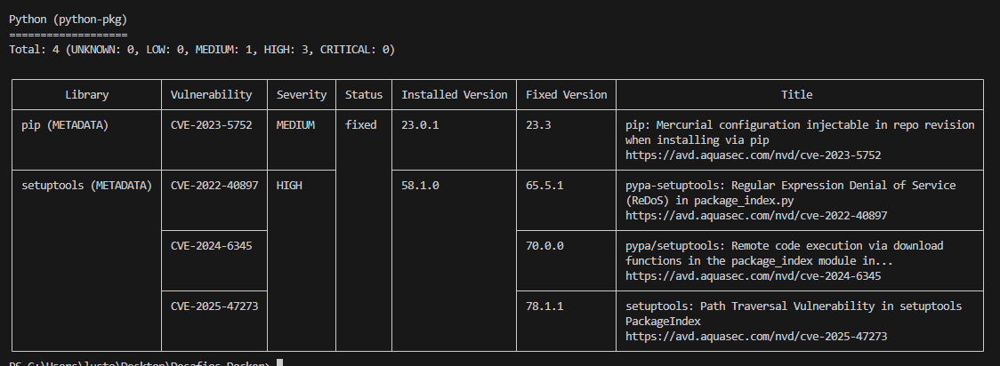
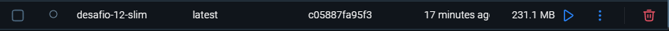
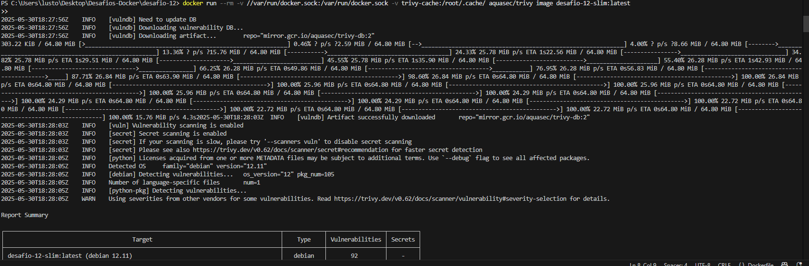
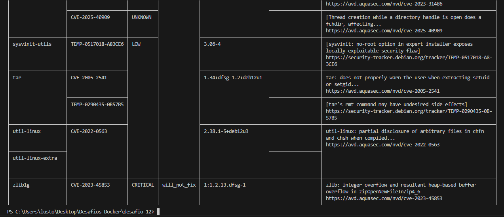
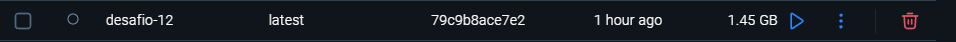

# DESAFIO -12
## ✅ Descrição
## Após identificar vulnerabilidades em imagens Docker com ferramentas como o Trivy, o próximo passo é a correção. Imagens grandes e genéricas frequentemente incluem bibliotecas desnecessárias e vulneráveis, além de usarem o usuário root por padrão.
## - 1 Usei o comando `docker run --rm -v //var/run/docker.sock:/var/run/docker.sock aquasec/trivy:latest image python:3.9` para verificar a imagem python:3.9, foram encontradas vulnerabilidades, como mostrado na imagem abaixo:

## - 1.1 Imagem com vulnerabilidades e más práticas
```dockerfile
 FROM python:3.9-slim
 WORKDIR /app
 COPY requirements.txt .
 RUN pip install -r requirements.txt
 COPY . .
 CMD ["python", "app.py"]
```
## - 2 Para corrigir essas vulnerabilidades, criei um Dockerfile que utiliza uma imagem base mais leve, como uma imagem slim, e inclui apenas as bibliotecas necessárias. O Dockerfile é o seguinte:
```dockerfile
FROM python:3.9-slim
RUN adduser --system --group --no-create-home --disabled-login appuser
WORKDIR /app
COPY requirements.txt .
RUN pip install --no-cache-dir -r requirements.txt
RUN chown -R appuser:appuser /app
USER appuser
COPY . .
CMD [ "python", "app.py" ]
```
## - 2.1 Explicação do requirement.txt
## O arquivo requirements.txt contém as dependências necessárias para o aplicativo Python. Neste caso, inclui Flask, que é um microframework para Python, e outras bibliotecas essenciais.
```txt
flask==3.1.1
pip==23.3.0
setuptools==78.1.1
```
## - 3 diferenças entre as imagens
## A imagem corrigida é significativamente menor, pois utiliza uma base slim e remove bibliotecas desnecessárias :
 
## - 3.1 use o comando `docker run --rm -v //var/run/docker.sock:/var/run/docker.sock -v trivy-cache:/root/.cache/ aquasec/trivy image desafio-12-slim:latest `
para verificar a imagem desafio-12-slim:latest, e as vunerabilidades foram corrigidas, como mostrado na imagem abaixo:
 
 

## a imagem antiga é maior e contém bibliotecas desnecessárias, o que aumenta a superfície de ataque e as vulnerabilidades potenciais:

