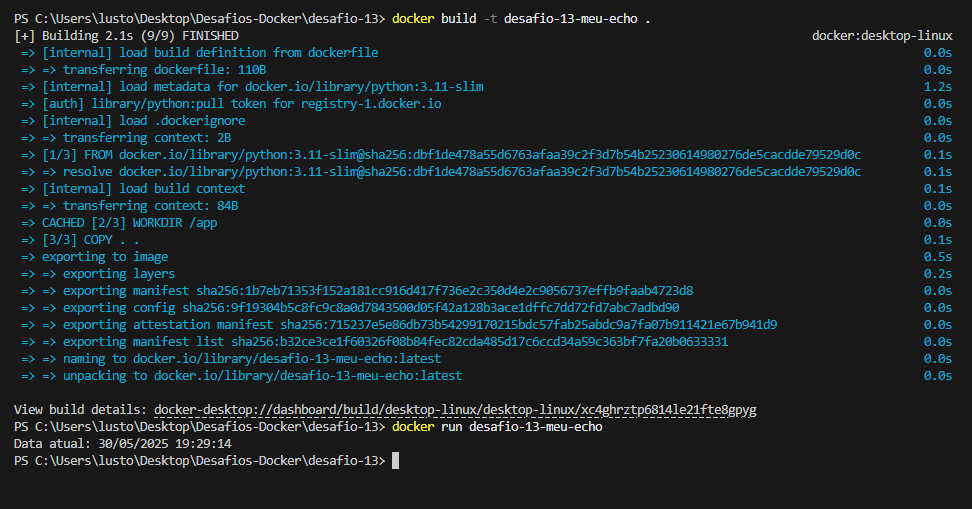

# DESAFIO -13
## ✅ Descrição
## criar uma imagem com python:3.11-slim e enviar ao Docker Hub.
## - 1 Criei um Dockerfile que utiliza a imagem base python:3.11-slim com o seguinte dockerfile:
```dockerfile
FROM python:3.11-slim
WORKDIR /app
COPY . .
CMD [ "python", "app.py" ]
```
## - arquivo app.py
```python
from datetime import datetime
dataAtual = datetime.now()
print("Data atual:", dataAtual.strftime("%d/%m/%Y %H:%M:%S"))
```
## - 2 usei os seguintes comandos para construir e rodar a imagem:
```bash
docker build -t desafio-13-meu-echo .
docker run desafio-13-slim
```

## - 3 para enviar a imagem ao Docker Hub, usei os seguintes comandos:
```bash
docker login
docker tag desafio-13-meu-echo danilo548/desafio-13-meu-echo:latest
docker push danilo548/desafio-13-meu-echo:latest
```
## - 4 a imagem foi enviada com sucesso ao Docker Hub, como mostrado na imagem abaixo🌟:
