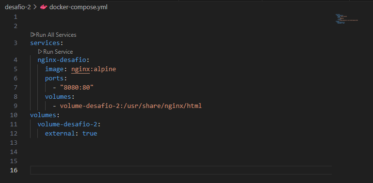
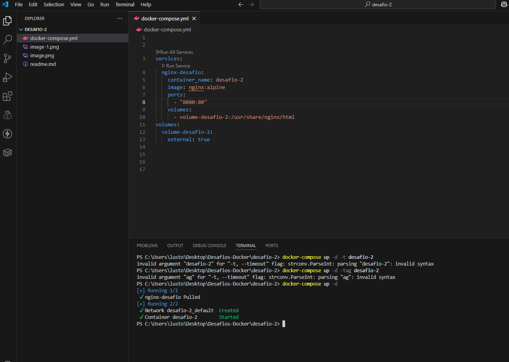
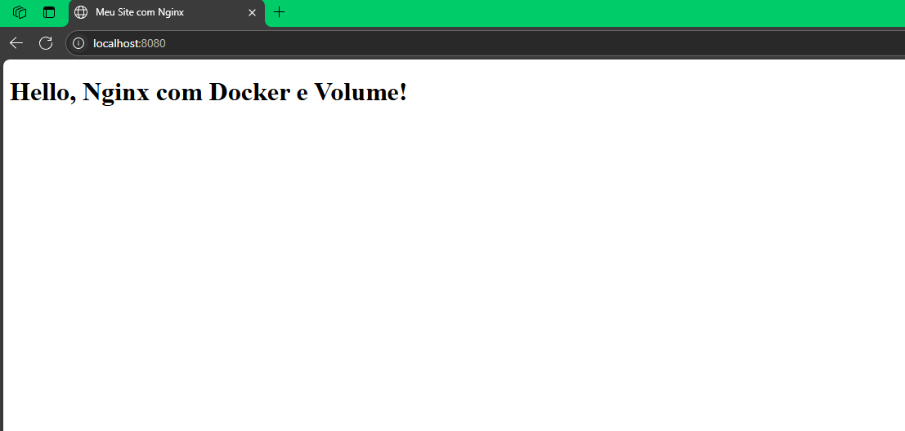

# DESAFIO -2
## ✅ Descrição
## - Criar um container que sirva uma página estática com **Nginx**, utilizando um volume local. 🦭 -

## 1 - Primeiro, foi criado um volume local:

## 2 -Em seguida, foi criado um arquivo `docker-compose.yaml` com a seguinte configuração:

## 3 -  funcionou com exito!!! 🎉

