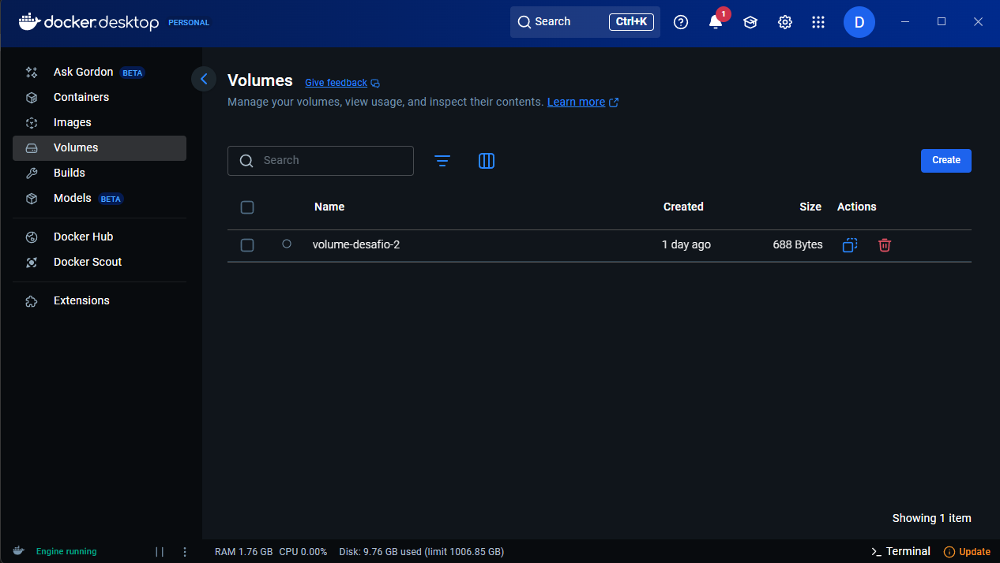
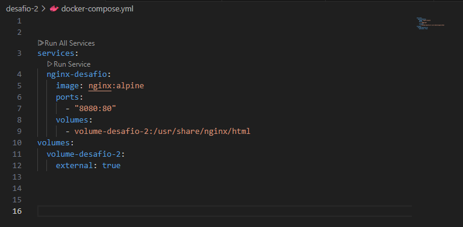
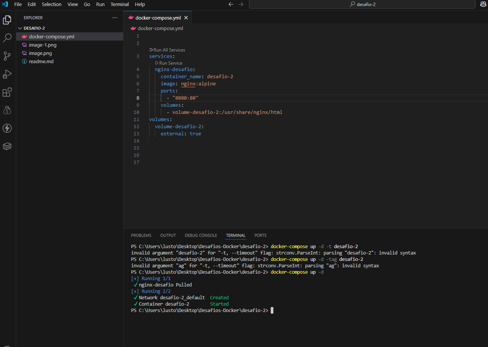
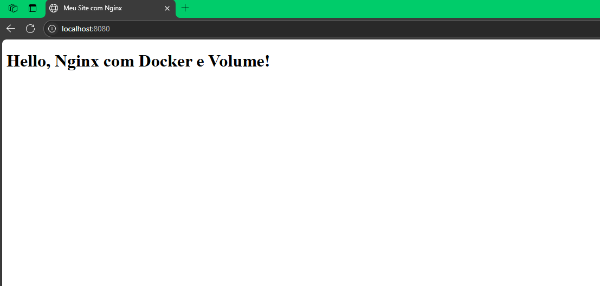

# DESAFIO -2
## -crie um container que sirva uma pagina estatica com nginx usando um volume loca 🦭-

## 1 - primeiro foi criado um volume local.

## 2 - em seguida foi criado um arquivo docker-compose.yaml com a seguinte configuração.

## 3 -  funcionou com exito!!! 🎉

