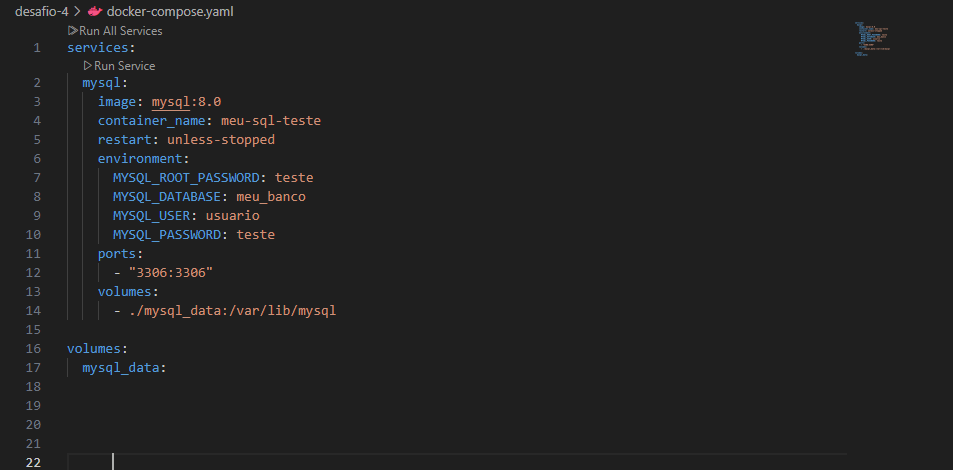
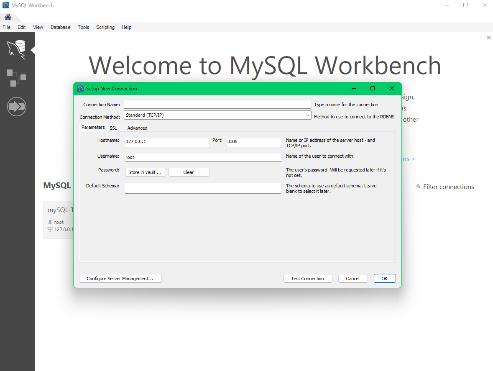
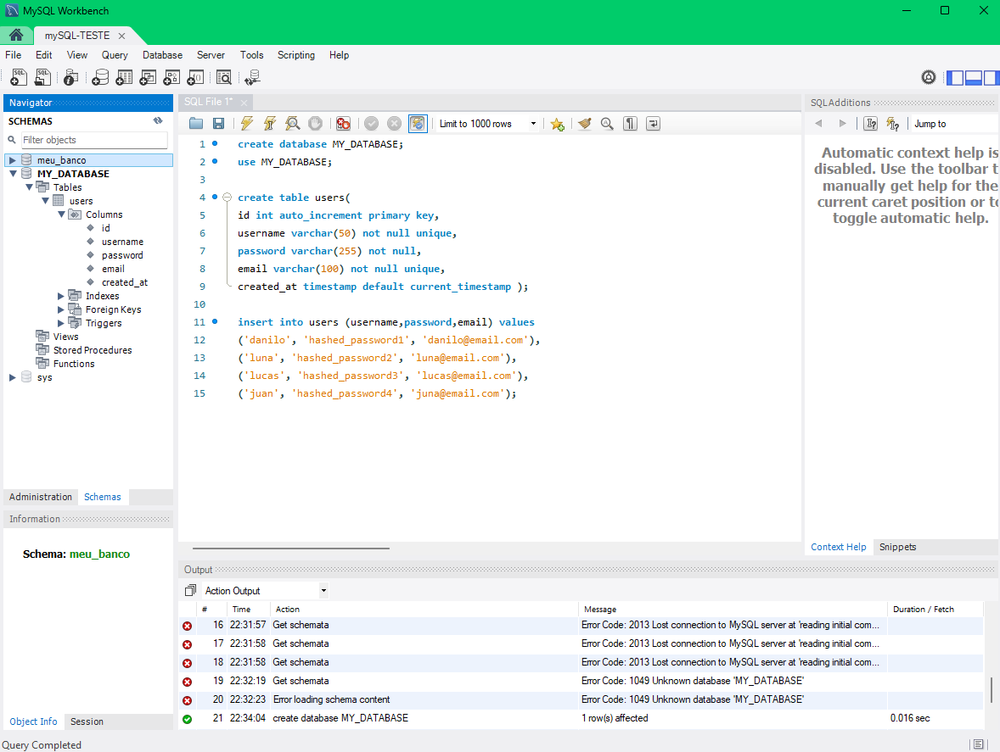
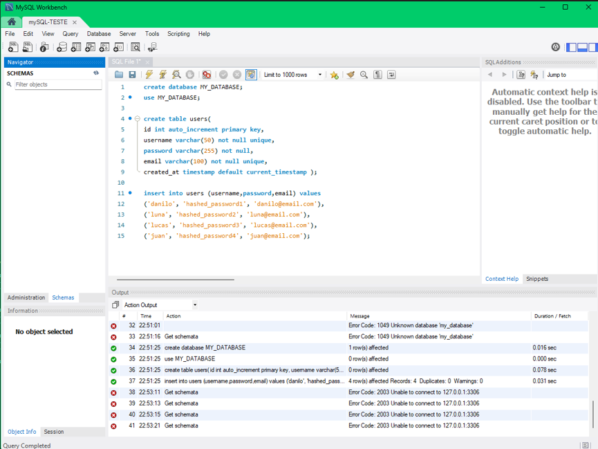
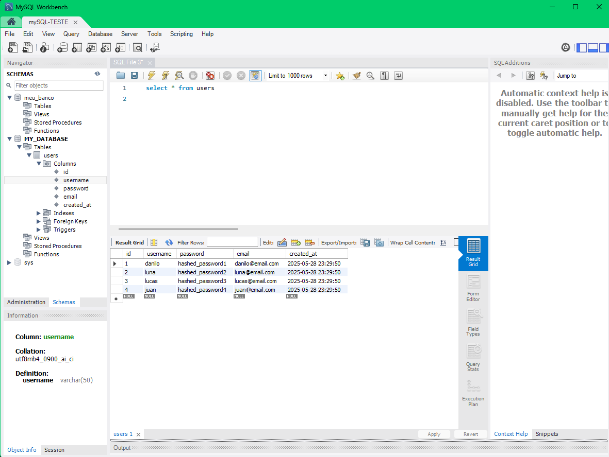

# DESAFIO -4 
## ✅ Descrição  
## Subi um container com a imagem MySQL, usando um volume nomeado para armazenar os dados. Criei um banco de dados, parei o container, subi novamente e confirmei que os dados persistiram.

## -1 Criei o `docker-compose` com as seguintes configurações:  

## -2 Depois, usei o comando `docker-compose up -d` para rodar o container com a imagem.  

## -3 Instalei o MySQL Workbench por meio deste [link](https://dev.mysql.com/downloads/workbench/) e fiz a conexão com o banco de dados no meu container.  

## -4 Criei um banco de dados `MY_DATABASE` e, dentro dele, uma tabela `users`.  

## -5 Derrubei o container e usei novamente o comando `docker-compose up -d` para subir minha aplicação e testar a persistência dos dados.  

## Os dados persistiram mesmo após refazer a conexão com o banco de dados! 🎉✨  

 

