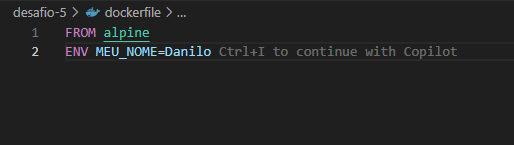
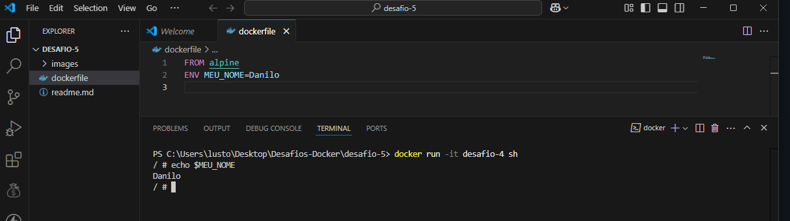

# DESAFIO -4  
## ✅ Descrição  
Crie um container Alpine com a variável `MEU_NOME` e imprima com `echo`.

## -1 Foi criado um `Dockerfile` com a seguinte configuração:  

## -2 Usei no terminal o comando `docker build -t desafio-4 .` e, em seguida, `docker run -it desafio-4 sh`.  

