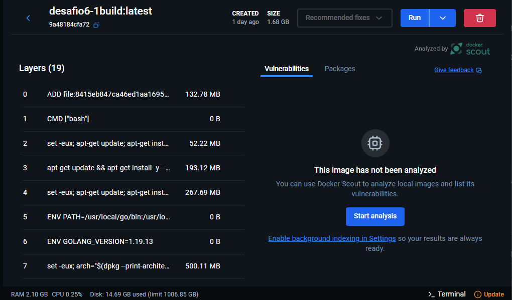
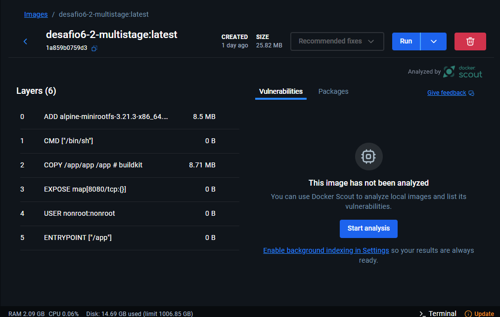

# DESAFIO -4 
## ✅ Descrição  
## Utilize um multi-stage build para otimizar uma aplicação Go, reduzindo o tamanho da imagem final.
## - 1 Imagem sem multi-stage-build:
```docker
FROM golang:1.19

WORKDIR /app

COPY go.mod go.sum ./

RUN go mod download

COPY *.go ./

RUN CGO_ENABLED=0 GOOS=linux go build -o /docker-gs-ping

EXPOSE 8080

CMD [ "/docker-gs-ping" ]
```
## 1.1 tamanho da imagem sem muitl-stage-build 📉
 

## - 2 imagem com muitl-stage-build 📈
```docker
FROM golang:1.23 AS builder

WORKDIR /app
COPY go.mod go.sum ./
RUN go mod download

COPY . .
RUN CGO_ENABLED=0 GOOS=linux go build -o /app/app

FROM alpine:latest
COPY --from=builder /app/app /app
EXPOSE 8080
USER nonroot:nonroot
ENTRYPOINT ["/app"]
```
## 2.2 tamanho da imagem com muitl-stage-build
 
### 🐳 Explicação do Dockerfile muitl-stage-build 🛟

**Linha 1 –** `FROM golang:1.23 AS builder` – Cria a imagem base com Go e define como etapa de build (`builder`);

**Linha 3 –** `WORKDIR /app` – Define o diretório de trabalho para `/app`;

**Linha 4 –** `COPY go.mod go.sum ./` – Copia os arquivos de dependência;

**Linha 5 –** `RUN go mod download` – Baixa as dependências do projeto;

**Linha 7 –** `COPY . .` – Copia todos os arquivos do projeto para o container;

**Linha 8 –** `RUN CGO_ENABLED=0 GOOS=linux go build -o /app/app` – Compila o projeto em um binário estático para Linux;

**Linha 10 –** `FROM alpine:latest` – Usa uma imagem leve (Alpine) para o container final;

**Linha 11 –** `COPY --from=builder /app/app /app` – Copia o binário gerado da etapa de build para o container final;

**Linha 12 –** `EXPOSE 8080` – Informa a porta que será usada pelo app;

**Linha 13 –** `USER nonroot:nonroot` – Define um usuário não-root para executar a aplicação;

**Linha 14 –** `ENTRYPOINT ["/app"]` – Define o binário como ponto de entrada da aplicação.
