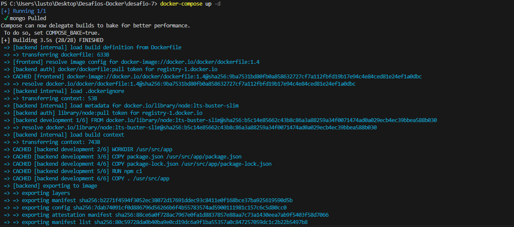
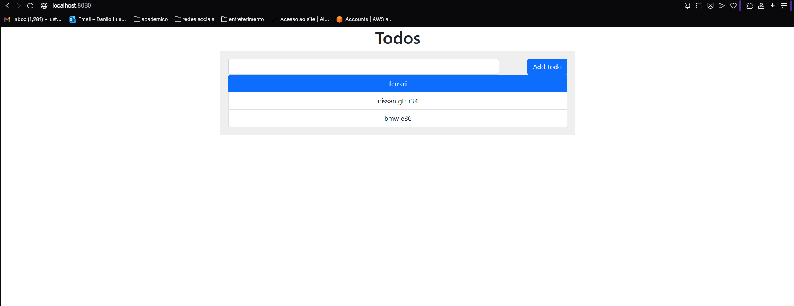

 # DESAFIO -7
## ✅ Descrição 
## Crie um projeto com Docker Compose para executar o projeto ReactExpress com MongoDB.
## - 1 Criei um arquivo docker-compose com a seguinte configuração:
```docker
services:
  frontend:
    build:
      context: frontend
      target: development
    ports:
      - 8080:3000
    volumes:
      - ./frontend:/usr/src/app
      - /usr/src/app/node_modules
    restart: unless-stopped
    networks:
      - app-network
    depends_on:
      - backend

  backend:
    restart: unless-stopped
    build:
      context: backend
      target: development
    volumes:
      - ./backend:/usr/src/app
      - /usr/src/app/node_modules
    depends_on:
      - mongo
    networks:
      - app-network
 
  mongo:
    restart: unless-stopped
    image: mongo:4.2.0
    volumes:
      - mongo-db:/data/db
    networks:
      - app-network

networks:
    app-network:

volumes:
  mongo-db:
```
## - 2 Usei o comando `docker-compose up -d` e abri o navegador e digitei `localhost:8080`

## - 2.1 container funcionou com exito!🐳
 