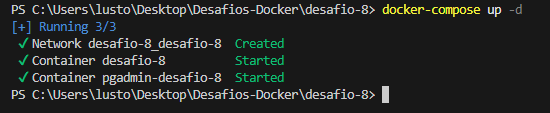
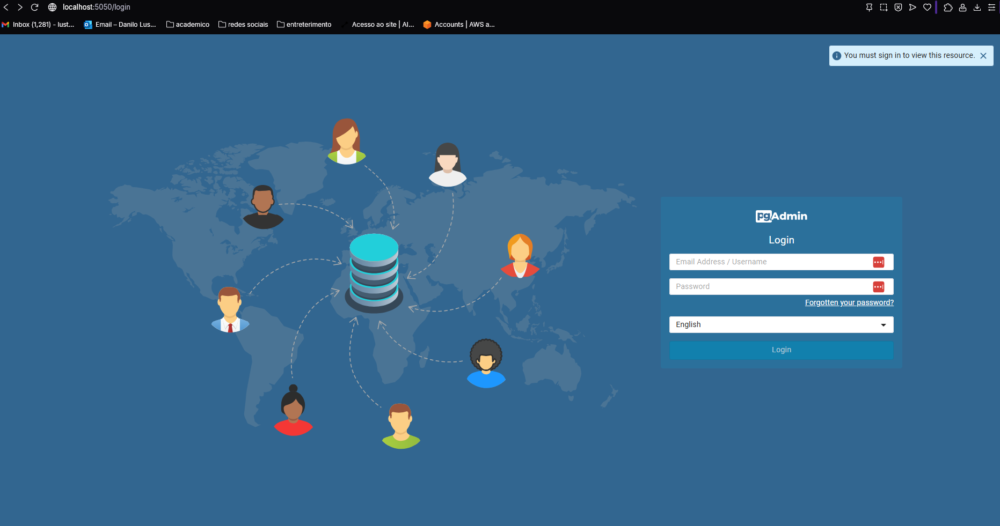
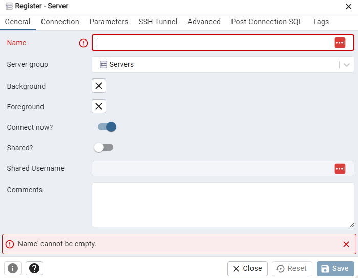
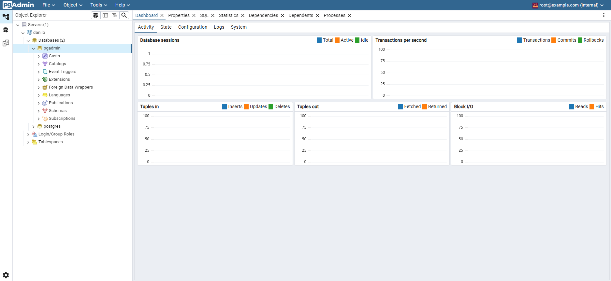

 # DESAFIO -7
## ✅ Descrição 
## Utilize Docker Compose para configurar uma aplicação com um banco dedados PostgreSQL, use para isso o projeto pgadmin.
## primeiro foi criado o arquivo `docker-compose.yml` com a seguinte configuração:
```docker
services:
 postgres :
    image: postgres:latest
    container_name: desafio-8
    restart: always
    environment:
      - POSTGRES_USER=${POSTGRES_USER}
      - POSTGRES_PASSWORD=${POSTGRES_PASSWORD}
      - POSTGRES_DB=${POSTGRES_DB}
    volumes:
     - desafio-8:/var/lib/postgresql/dat
    networks:
      - desafio-8
    ports:
      - "5432:5432"
 pgadmin:
    image: dpage/pgadmin4:latest
    container_name: pgadmin-desafio-8
    restart: always
    environment:
      - PGADMIN_DEFAULT_EMAIL=${PGADMIN_MAIL}
      - PGADMIN_DEFAULT_PASSWORD=${PGADMIN_PASSWORD}
    ports:
      - "5050:80"
    depends_on: 
      - postgres
    networks:
      - desafio-8
    volumes:
      - desafio-8-pgadmin:/var/lib/pgadmin
    
    
volumes:
  desafio-8:
  desafio-8-pgadmin:
  
networks:
  desafio-8:
```
# - 2 Criei um arquivo `.env` com as seguintes variáveis de ambiente:
```env
POSTGRES_USER
POSTGRES_PASSWORD
POSTGRES_DB=pgadmin
PGADMIN_MAIL
PGADMIN_PASSWORD
```
##  - 2 Usei o comando `docker-compose up -d` e abri o navegador e digitei `localhost:5050`
 
 
## - 2.1 Fiz a conexão no pgAdmin usando as credenciais do arquivo `.env`
 
## - 2.2 container funcionou com exito!🐳
 
