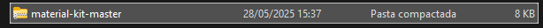
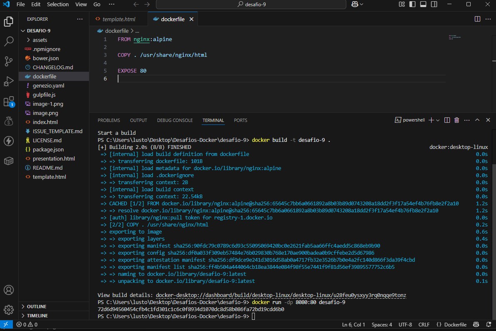
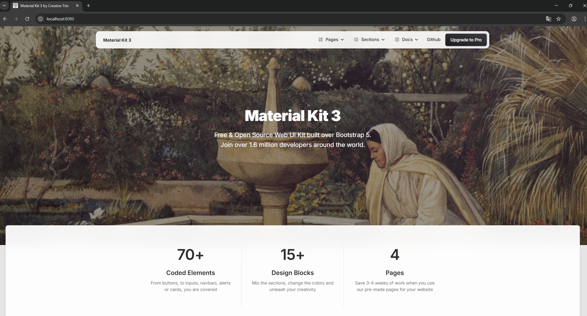

  # DESAFIO -9
## ✅ Descrição
## Construa uma imagem baseada no Nginx ou Apache, adicionando um siteHTML/CSS estático.
## - 1 Criei um arquivo `Dockerfile` com a seguinte configuração:
```dockerfile
FROM nginx:alpine
COPY . /usr/share/nginx/html
EXPOSE 80
```
## - 2 baixei o repositório do desafio:
 
## - 3 adicionei o arquivo `Dockerfile` na raiz do repositório e usei comando `docker build -t desafio-9 . ` e usei o comando `docker run -d -p 8080:80 desafio-9`
 
## - 4 abri o navegador e digitei `localhost:8080`
 
